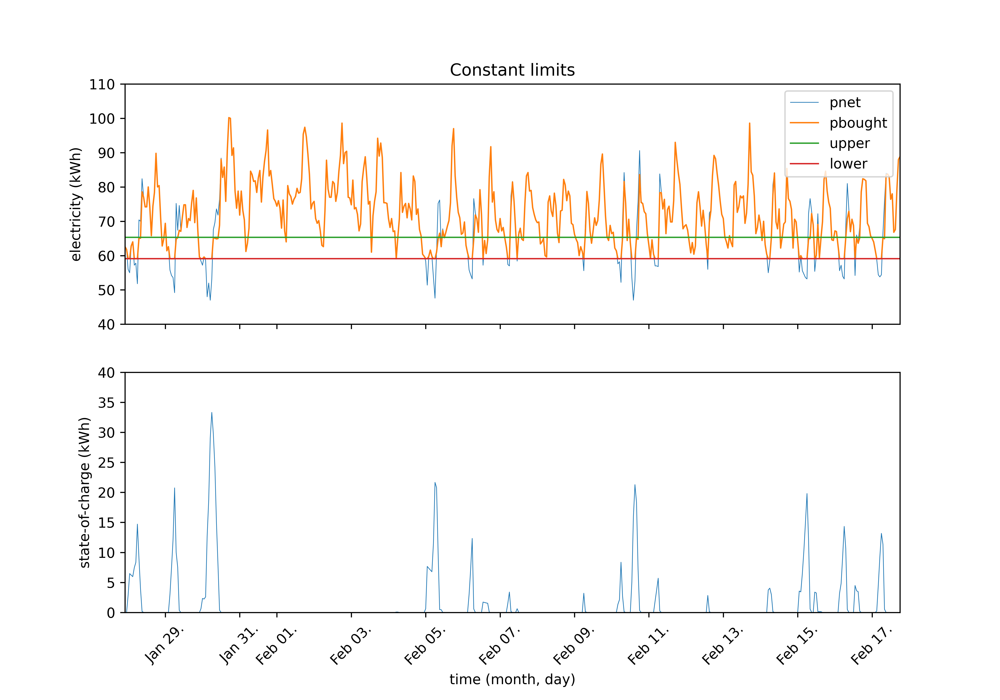
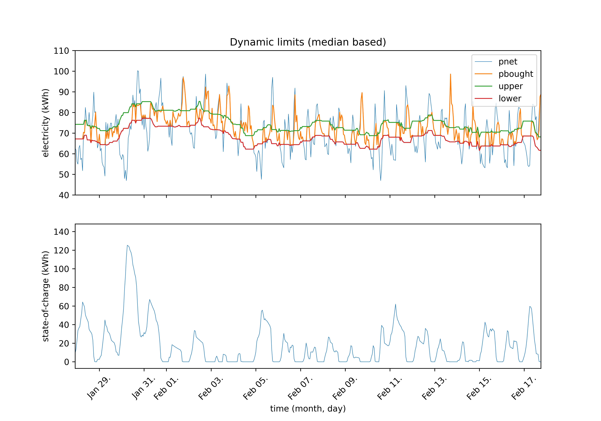
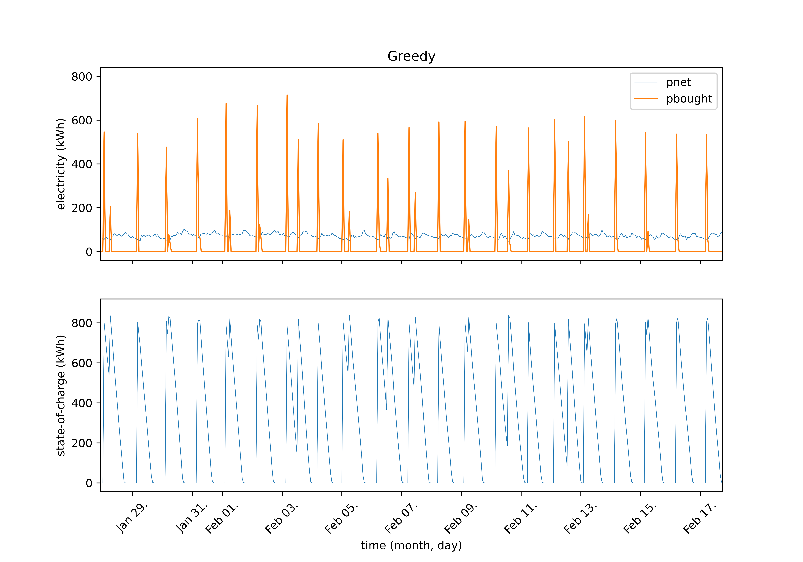

# Problem description
* Transformers provide a connection point grom the user to the electric grid.
* We want to deploy energy hubs to transformers.
* Energy hubs consist of multiple batteries.
* There are many kinds of batteries (Li-ion battery, flywheel, supercapacitor).
* We can control the charge of the batteries by deciding whether to charge or discharge a battery with given power, each hour.
* The capacity of a battery is set to be 100 kWh. We assume that each battery can be charged or discharged in an hour.
* Charging and discharging have efficiencies, that is, energy is lost due to heat. We also assume that there is a self-discharge rate, that is, some percentage of the stored energy is lost every hour.
* We want to find the optimal number of batteries in a given transformer.
* Dataset contains the net load (`power consumed - power produced`) with timestamp. Data is hourly.
* We assume that the dataset also contains price data.
* Peak-shaving problem. We are aiming to _shave off_ the peaks of the bought energy. That is, we want to use the stored energy when the net load would be high.

# Metrics and Objectives
* Total cost
  * Operational cost
  * Capital cost
  * Cost of electricity
  * Penalty for charging
* Fluctuation: $\frac{\sum{|p_i - p_{i - 1}|}}{\bar{p}}$, the sum of changes in power divided by the mean power.
* Periodic fluctuation: We compute the fluctuation for each day and take the average of it.
* Sum of peaks above the upper limit. Here we have to be careful with setting the upper limit, as a low sum could also be achieved by setting a very high upper limit.
* Count of peaks above the upper limit.
* Sum of bought electricity above the upper limit.
* Maximum electricity bought.

# Algorithms
* Constant limits:
  * If the net demand is below the lower limit, we buy electricity to charge our batteries. If it is above the upper limit, we use batteries if we can.
  * The upper and the lower limits are set beforehand, based on historical data. We take a one year long time series data for the net power load demand. We compute the median and then set the upper and lower limit with a margin between them:
    * `upper = data.median() * (1 + margin)`
    * `lower = data.median() * (1 - margin)`

* Dynamic limits based on the median of future values
  * Similar to the previous case, but limits change dynamically.
  * We try to predict the net load for the next 24 hours, and compute its median and calculate the upper and lower limits with a margin:
    * `upper[t] = data[t:t+24].median() * (1 + margin)`
    * `lower[t] = data[t:t+24].median() * (1 - margin)`

* Dynamic limits that equalizes the area above and below the upper and lower limits
  * We use predicted data of the next 24 hours and use binary search to find the upper and lower limit. Constraints are:
    * `abs(upper - lower) = margin`, where the input parameter `margin` is a ratio of the distance between the max and min.
    * `abs(area_upper - area_lower) < tolerance`, where `tolerance` is an input parameter, `area_upper` is the approximation of the area above the upper limit and `area_lower` is the approximation of the area below the lower limit.
  * There is a possibility to multiply the lower limit by th input parameter `factor`. 
  

* Greedy algorithm
  * The basic principle of the greedy algorithm is that if the electricity is cheap, we should buy as much as we can to charge our batteries and use the batteries when electricity is more expensive.
  * The algorithm computes how long the batteries would last and then looks that far into the future to see if there would be cheaper electricity prices later. If there is a future cheaper price, we wait until then, otherwise, we buy electricity to charge our batteries.

# Results

## Results with constant limits

### Minimizing the sum of peaks above the upper limit

| LiIon | Flywheel | Supercapacitor | Margin | Fitness | Cost | fluctuation | mean_periodic_fluctuation | max_bought | peak_power_sum | peak_power_count | sum_above_limit |
| - | - | - | - | - | - | - | - | - | - | - | - |
| 0.0 | 8.0 | 0.0 | 0.2 | 64.1 | 1560.06 | 392.2 | 1.83 | 113.8 | 1560.06 | 97.0 | 7097.57 |
| 9.0 | 6.0 | 0.0 | 0.1848 | 63.04 | 1586.22 | 369.45 | 1.71 | 113.8 | 1586.22 | 96.0 | 7186.77 |
| 7.0 | 7.0 | 0.0 | 0.1848 | 62.32 | 1604.68 | 371.1 | 1.72 | 113.8 | 1604.68 | 97.0 | 7312.69 |
| 8.0 | 8.0 | 0.0 | 0.1848 | 62.09 | 1610.68 | 367.69 | 1.7 | 113.8 | 1610.68 | 97.0 | 7338.39 |
| 7.0 | 8.0 | 0.0 | 0.1848 | 62.09 | 1610.68 | 368.72 | 1.71 | 113.8 | 1610.68 | 97.0 | 7338.39 |
| 9.0 | 8.0 | 0.0 | 0.1848 | 62.09 | 1610.68 | 366.24 | 1.69 | 113.8 | 1610.68 | 97.0 | 7338.39 |

### Minimizing the sum above the upper limit

| LiIon | Flywheel | Supercapacitor | Margin | Fitness | Cost | fluctuation | mean_periodic_fluctuation | max_bought | peak_power_sum | peak_power_count | sum_above_limit |
| - | - | - | - | - | - | - | - | - | - | - | - |
| 9.0 | 9.0 | 0.0 | 0.182 | 12.79 | 7817.08 | 365.59 | 1.7 | 113.8 | 1656.54 | 97.0 | 7817.08 |
| 9.0 | 8.0 | 0.0 | 0.1611 | 11.39 | 8776.83 | 354.34 | 1.65 | 113.8 | 1744.5 | 96.0 | 8776.83 |
| 8.0 | 9.0 | 0.0 | 0.1611 | 11.36 | 8805.51 | 353.63 | 1.65 | 113.8 | 1753.56 | 97.0 | 8805.51 |
| 9.0 | 7.0 | 0.0 | 0.1611 | 11.31 | 8845.31 | 359.44 | 1.68 | 113.8 | 1763.38 | 97.0 | 8845.31 |
| 8.0 | 8.0 | 0.0 | 0.1611 | 11.27 | 8874.9 | 358.17 | 1.67 | 113.8 | 1766.28 | 97.0 | 8874.9 |
| 7.0 | 8.0 | 0.0 | 0.1611 | 11.14 | 8974.51 | 360.89 | 1.69 | 113.8 | 1774.08 | 97.0 | 8974.51 |

### Minimizing the cost

| LiIon | Flywheel | Supercapacitor | Margin | Fitness | Cost | fluctuation | mean_periodic_fluctuation | max_bought | peak_power_sum | peak_power_count | sum_above_limit |
| - | - | - | - | - | - | - | - | - | - | - | - |
| 0.0 | 0.0 | 0.0 | 0.1828 | 0.48 | 209902.85 | 466.5 | 2.22 | 113.8 | 2146.64 | 153.0 | 9669.84 |
| 0.0 | 0.0 | 2.0 | 0.1828 | 0.46 | 219565.31 | 359.17 | 1.62 | 113.8 | 1951.99 | 128.0 | 9177.32 |
| 0.0 | 0.0 | 1.0 | 0.0823 | 0.46 | 216137.71 | 335.27 | 1.55 | 113.8 | 2675.89 | 129.0 | 17224.02 |
| 0.0 | 2.0 | 0.0 | 0.0711 | 0.45 | 220438.2 | 365.91 | 1.75 | 113.8 | 2549.05 | 114.0 | 17612.3 |
| 1.0 | 0.0 | 2.0 | 0.1717 | 0.45 | 223679.88 | 350.48 | 1.58 | 113.8 | 2033.02 | 126.0 | 9919.09 |
| 0.0 | 1.0 | 2.0 | 0.0648 | 0.44 | 227322.57 | 273.17 | 1.23 | 113.8 | 2735.81 | 124.0 | 18762.93 |

### Minimizing fluctuation

| LiIon | Flywheel | Supercapacitor | Margin | Fitness | Cost | fluctuation | mean_periodic_fluctuation | max_bought | peak_power_sum | peak_power_count | sum_above_limit |
| - | - | - | - | - | - | - | - | - | - | - | - |
| 5.0 | 9.0 | 4.0 | 0.0004 | 594.47 | 168.22 | 168.22 | 0.71 | 113.8 | 3267.74 | 131.0 | 25616.23 |
| 5.0 | 7.0 | 8.0 | 0.0041 | 591.41 | 169.09 | 169.09 | 0.71 | 113.8 | 3254.74 | 132.0 | 25216.54 |
| 5.0 | 6.0 | 5.0 | 0.0041 | 591.41 | 169.09 | 169.09 | 0.71 | 113.8 | 3254.74 | 132.0 | 25216.54 |
| 2.0 | 7.0 | 5.0 | 0.0041 | 591.41 | 169.09 | 169.09 | 0.71 | 113.8 | 3254.74 | 132.0 | 25216.54 |
| 9.0 | 7.0 | 9.0 | 0.0041 | 591.41 | 169.09 | 169.09 | 0.71 | 113.8 | 3254.74 | 132.0 | 25216.54 |
| 5.0 | 9.0 | 9.0 | 0.0041 | 591.41 | 169.09 | 169.09 | 0.71 | 113.8 | 3254.74 | 132.0 | 25216.54 |

### Minimizing the maximum bought power

| LiIon | Flywheel | Supercapacitor | Margin | Fitness | Cost | fluctuation | mean_periodic_fluctuation | max_bought | peak_power_sum | peak_power_count | sum_above_limit |
| - | - | - | - | - | - | - | - | - | - | - | - |
| 4.0 | 7.0 | 0.0 | 0.1957 | 878.73 | 113.8 | 385.08 | 1.8 | 113.8 | 1601.67 | 98.0 | 7210.22 |
| 8.0 | 6.0 | 0.0 | 0.0222 | 878.73 | 113.8 | 279.99 | 1.34 | 113.8 | 2672.05 | 106.0 | 20630.46 |
| 8.0 | 6.0 | 7.0 | 0.038 | 878.73 | 113.8 | 207.23 | 0.89 | 113.8 | 2972.13 | 129.0 | 21625.32 |
| 2.0 | 6.0 | 9.0 | 0.0611 | 878.73 | 113.8 | 232.05 | 1.0 | 113.8 | 2810.89 | 128.0 | 19265.05 |
| 7.0 | 6.0 | 9.0 | 0.1307 | 878.73 | 113.8 | 302.45 | 1.33 | 113.8 | 2340.35 | 129.0 | 12991.7 |
| 7.0 | 2.0 | 1.0 | 0.1657 | 878.73 | 113.8 | 349.3 | 1.59 | 113.8 | 1980.26 | 115.0 | 10046.79 |

## Results with dynamic limits

### Minimizing fluctuation

| LiIon | Flywheel | Supercapacitor | Margin | Lookahead | Fitness | Cost | fluctuation | mean_periodic_fluctuation | max_bought | peak_power_sum | peak_power_count | sum_above_limit |
| - | - | - | - | - | - | - | - | - | - | - | - | - |
| 8.0 | 2.0 | 0.0 | 0.0007 | 24.0 | 1701.55 | 58.77 | 58.77 | 0.24 | 93.05 | 489.73 | 39.0 | 1317.4 |
| 9.0 | 2.0 | 0.0 | 0.0043 | 24.0 | 1668.91 | 59.92 | 59.92 | 0.25 | 93.2 | 475.02 | 37.0 | 1270.52 |
| 7.0 | 2.0 | 0.0 | 0.0043 | 24.0 | 1659.84 | 60.25 | 60.25 | 0.25 | 93.2 | 475.02 | 37.0 | 1270.52 |
| 8.0 | 4.0 | 0.0 | 0.0043 | 24.0 | 1635.75 | 61.13 | 61.13 | 0.25 | 93.2 | 512.27 | 41.0 | 1344.64 |
| 3.0 | 8.0 | 0.0 | 0.0027 | 24.0 | 1630.92 | 61.32 | 61.32 | 0.39 | 93.2 | 559.46 | 43.0 | 1479.98 |
| 6.0 | 2.0 | 0.0 | 0.0043 | 24.0 | 1610.91 | 62.08 | 62.08 | 0.26 | 93.2 | 475.02 | 37.0 | 1270.52 |

### Minimizing the maximum bought power

| LiIon | Flywheel | Supercapacitor | Margin | Lookahead | Fitness | Cost | fluctuation | mean_periodic_fluctuation | max_bought | peak_power_sum | peak_power_count | sum_above_limit |
| - | - | - | - | - | - | - | - | - | - | - | - | - |
| 7.0 | 1.0 | 0.0 | 0.0031 | 24.0 | 1072.96 | 93.2 | 61.98 | 0.26 | 93.2 | 452.74 | 37.0 | 1199.26 |
| 9.0 | 0.0 | 0.0 | 0.0074 | 24.0 | 1072.96 | 93.2 | 65.6 | 0.28 | 93.2 | 383.4 | 32.0 | 1013.95 |
| 9.0 | 1.0 | 0.0 | 0.0031 | 24.0 | 1072.96 | 93.2 | 58.51 | 0.24 | 93.2 | 452.74 | 37.0 | 1199.26 |
| 6.0 | 5.0 | 0.0 | 0.0031 | 24.0 | 1072.96 | 93.2 | 61.46 | 0.54 | 93.2 | 553.9 | 43.0 | 1426.03 |
| 1.0 | 5.0 | 0.0 | 0.0031 | 24.0 | 1072.96 | 93.2 | 62.48 | 0.4 | 93.2 | 557.1 | 43.0 | 1472.88 |
| 6.0 | 0.0 | 0.0 | 0.0103 | 24.0 | 1072.96 | 93.2 | 77.11 | 0.71 | 93.2 | 404.89 | 31.0 | 1038.61 |

### Minimizing the sum of peaks above the upper limit

| LiIon | Flywheel | Supercapacitor | Margin | Lookahead | Fitness | Cost | fluctuation | mean_periodic_fluctuation | max_bought | peak_power_sum | peak_power_count | sum_above_limit |
| - | - | - | - | - | - | - | - | - | - | - | - | - |
| 8.0 | 0.0 | 0.0 | 0.0966 | 24.0 | 436.32 | 229.19 | 232.28 | 1.07 | 100.96 | 229.19 | 22.0 | 535.97 |
| 9.0 | 0.0 | 0.0 | 0.1134 | 24.0 | 413.12 | 242.06 | 258.63 | 1.19 | 102.69 | 242.06 | 29.0 | 527.1 |
| 7.0 | 0.0 | 0.0 | 0.1134 | 24.0 | 413.12 | 242.06 | 261.94 | 1.21 | 102.69 | 242.06 | 29.0 | 527.1 |
| 6.0 | 0.0 | 0.0 | 0.1134 | 24.0 | 413.12 | 242.06 | 263.95 | 1.22 | 102.69 | 242.06 | 29.0 | 527.1 |
| 4.0 | 0.0 | 0.0 | 0.1134 | 24.0 | 413.12 | 242.06 | 267.26 | 1.24 | 102.69 | 242.06 | 29.0 | 527.1 |
| 2.0 | 0.0 | 0.0 | 0.1134 | 24.0 | 363.24 | 275.3 | 273.08 | 1.26 | 102.69 | 275.3 | 31.0 | 585.17 |

### Minimizing the sum above the upper limit

| LiIon | Flywheel | Supercapacitor | Margin | Lookahead | Fitness | Cost | fluctuation | mean_periodic_fluctuation | max_bought | peak_power_sum | peak_power_count | sum_above_limit |
| - | - | - | - | - | - | - | - | - | - | - | - | - |
| 9.0 | 0.0 | 0.0 | 0.1165 | 24.0 | 190.05 | 526.17 | 265.04 | 1.19 | 103.01 | 244.75 | 29.0 | 526.17 |
| 6.0 | 0.0 | 0.0 | 0.1187 | 24.0 | 189.88 | 526.66 | 273.65 | 1.23 | 103.23 | 246.28 | 30.0 | 526.66 |
| 7.0 | 0.0 | 0.0 | 0.1187 | 24.0 | 189.88 | 526.66 | 271.75 | 1.22 | 103.23 | 246.28 | 30.0 | 526.66 |
| 8.0 | 0.0 | 0.0 | 0.1041 | 24.0 | 188.62 | 530.16 | 246.35 | 1.1 | 101.73 | 229.43 | 22.0 | 530.16 |
| 7.0 | 1.0 | 0.0 | 0.1864 | 24.0 | 169.29 | 590.7 | 357.96 | 1.61 | 105.65 | 347.7 | 49.0 | 590.7 |
| 9.0 | 1.0 | 0.0 | 0.1864 | 24.0 | 169.29 | 590.7 | 357.96 | 1.61 | 105.65 | 347.7 | 49.0 | 590.7 |

### Minimizing the cost

| LiIon | Flywheel | Supercapacitor | Margin | Lookahead | Fitness | Cost | fluctuation | mean_periodic_fluctuation | max_bought | peak_power_sum | peak_power_count | sum_above_limit |
| - | - | - | - | - | - | - | - | - | - | - | - | - |
| 0.0 | 0.0 | 0.0 | 0.187 | 24.0 | 0.48 | 209902.85 | 466.5 | 2.22 | 113.8 | 1566.8 | 203.0 | 3328.88 |
| 0.0 | 0.0 | 1.0 | 0.1026 | 24.0 | 0.47 | 213687.67 | 275.18 | 1.28 | 108.57 | 1317.8 | 128.0 | 3289.39 |
| 1.0 | 0.0 | 2.0 | 0.1431 | 24.0 | 0.46 | 219683.54 | 327.49 | 1.52 | 108.59 | 1066.86 | 128.0 | 2514.75 |
| 0.0 | 1.0 | 1.0 | 0.1431 | 24.0 | 0.46 | 219199.87 | 327.49 | 1.52 | 108.59 | 1066.86 | 128.0 | 2514.75 |
| 0.0 | 0.0 | 2.0 | 0.1026 | 24.0 | 0.46 | 217037.76 | 274.21 | 1.27 | 108.57 | 1313.31 | 128.0 | 3283.52 |
| 2.0 | 0.0 | 2.0 | 0.0609 | 24.0 | 0.45 | 222620.7 | 209.57 | 0.97 | 108.45 | 1606.87 | 137.0 | 4417.51 |

## Results with equalized limits

### Minimizing the sum above the upper limit

| LiIon | Flywheel | Supercapacitor | Lookahead | Fitness | Cost | fluctuation | mean_periodic_fluctuation | max_bought | peak_power_sum | peak_power_count | sum_above_limit |
| - | - | - | - | - | - | - | - | - | - | - | - |
| 9.0 | 0.0 | 0.0 | 24.0 | 231.21 | 432.5 | 335.93 | 1.58 | 108.59 | 259.96 | 65.0 | 432.5 |
| 7.0 | 0.0 | 0.0 | 24.0 | 231.21 | 432.5 | 335.93 | 1.58 | 108.59 | 259.96 | 65.0 | 432.5 |
| 4.0 | 0.0 | 0.0 | 24.0 | 231.21 | 432.5 | 335.93 | 1.58 | 108.59 | 259.96 | 65.0 | 432.5 |
| 5.0 | 0.0 | 0.0 | 24.0 | 231.21 | 432.5 | 335.93 | 1.58 | 108.59 | 259.96 | 65.0 | 432.5 |
| 1.0 | 0.0 | 0.0 | 24.0 | 231.21 | 432.5 | 336.06 | 1.58 | 108.59 | 259.96 | 65.0 | 432.5 |
| 3.0 | 0.0 | 0.0 | 24.0 | 231.21 | 432.5 | 335.93 | 1.58 | 108.59 | 259.96 | 65.0 | 432.5 |

### Minimizing the cost

| LiIon | Flywheel | Supercapacitor | Lookahead | Fitness | Cost | fluctuation | mean_periodic_fluctuation | max_bought | peak_power_sum | peak_power_count | sum_above_limit |
| - | - | - | - | - | - | - | - | - | - | - | - |
| 0.0 | 0.0 | 1.0 | 24.0 | 0.47 | 213155.99 | 361.29 | 1.7 | 110.36 | 956.76 | 168.0 | 1581.92 |
| 0.0 | 1.0 | 0.0 | 24.0 | 0.47 | 214345.31 | 337.58 | 1.59 | 108.63 | 299.18 | 69.0 | 493.34 |
| 0.0 | 0.0 | 2.0 | 24.0 | 0.46 | 216500.15 | 361.29 | 1.7 | 110.36 | 956.76 | 168.0 | 1581.92 |
| 0.0 | 1.0 | 1.0 | 24.0 | 0.46 | 218763.66 | 361.29 | 1.7 | 110.36 | 956.76 | 168.0 | 1581.92 |
| 1.0 | 0.0 | 1.0 | 24.0 | 0.46 | 215903.16 | 361.29 | 1.7 | 110.36 | 956.76 | 168.0 | 1581.92 |
| 0.0 | 0.0 | 3.0 | 24.0 | 0.45 | 219844.3 | 361.29 | 1.7 | 110.36 | 956.76 | 168.0 | 1581.92 |

### Minimizing fluctuation

| LiIon | Flywheel | Supercapacitor | Lookahead | Fitness | Cost | fluctuation | mean_periodic_fluctuation | max_bought | peak_power_sum | peak_power_count | sum_above_limit |
| - | - | - | - | - | - | - | - | - | - | - | - |
| 5.0 | 1.0 | 0.0 | 24.0 | 296.34 | 337.46 | 337.46 | 1.59 | 108.63 | 299.18 | 69.0 | 493.34 |
| 3.0 | 7.0 | 0.0 | 24.0 | 296.34 | 337.46 | 337.46 | 1.59 | 108.63 | 299.18 | 69.0 | 493.34 |
| 5.0 | 3.0 | 0.0 | 24.0 | 296.34 | 337.46 | 337.46 | 1.59 | 108.63 | 299.18 | 69.0 | 493.34 |
| 2.0 | 4.0 | 0.0 | 24.0 | 296.34 | 337.46 | 337.46 | 1.59 | 108.63 | 299.18 | 69.0 | 493.34 |
| 2.0 | 2.0 | 0.0 | 24.0 | 296.34 | 337.46 | 337.46 | 1.59 | 108.63 | 299.18 | 69.0 | 493.34 |
| 9.0 | 2.0 | 0.0 | 24.0 | 296.34 | 337.46 | 337.46 | 1.59 | 108.63 | 299.18 | 69.0 | 493.34 |

### Minimizing the maximum bought power

| LiIon | Flywheel | Supercapacitor | Lookahead | Fitness | Cost | fluctuation | mean_periodic_fluctuation | max_bought | peak_power_sum | peak_power_count | sum_above_limit |
| - | - | - | - | - | - | - | - | - | - | - | - |
| 3.0 | 1.0 | 0.0 | 24.0 | 920.58 | 108.63 | 337.46 | 1.59 | 108.63 | 299.18 | 69.0 | 493.34 |
| 4.0 | 2.0 | 0.0 | 24.0 | 920.58 | 108.63 | 337.46 | 1.59 | 108.63 | 299.18 | 69.0 | 493.34 |
| 6.0 | 8.0 | 0.0 | 24.0 | 920.58 | 108.63 | 337.46 | 1.59 | 108.63 | 299.18 | 69.0 | 493.34 |
| 3.0 | 3.0 | 0.0 | 24.0 | 920.58 | 108.63 | 337.46 | 1.59 | 108.63 | 299.18 | 69.0 | 493.34 |
| 3.0 | 6.0 | 0.0 | 24.0 | 920.58 | 108.63 | 337.46 | 1.59 | 108.63 | 299.18 | 69.0 | 493.34 |
| 6.0 | 4.0 | 0.0 | 24.0 | 920.58 | 108.63 | 337.46 | 1.59 | 108.63 | 299.18 | 69.0 | 493.34 |

### Minimizing the sum of peaks above the upper limit

| LiIon | Flywheel | Supercapacitor | Lookahead | Fitness | Cost | fluctuation | mean_periodic_fluctuation | max_bought | peak_power_sum | peak_power_count | sum_above_limit |
| - | - | - | - | - | - | - | - | - | - | - | - |
| 2.0 | 0.0 | 0.0 | 24.0 | 402.6 | 248.38 | 333.9 | 1.57 | 108.59 | 248.38 | 64.0 | 336.88 |
| 5.0 | 7.0 | 0.0 | 24.0 | 347.7 | 287.61 | 335.42 | 1.57 | 108.63 | 287.61 | 68.0 | 397.7 |
| 1.0 | 7.0 | 0.0 | 24.0 | 347.7 | 287.61 | 335.42 | 1.57 | 108.63 | 287.61 | 68.0 | 397.7 |
| 0.0 | 7.0 | 0.0 | 24.0 | 347.7 | 287.61 | 335.42 | 1.57 | 108.63 | 287.61 | 68.0 | 397.7 |
| 0.0 | 1.0 | 0.0 | 24.0 | 347.7 | 287.61 | 335.42 | 1.57 | 108.63 | 287.61 | 68.0 | 397.7 |
| 0.0 | 8.0 | 0.0 | 24.0 | 347.7 | 287.61 | 335.42 | 1.57 | 108.63 | 287.61 | 68.0 | 397.7 |

## Results with greedy algorithm

### Minimizing fluctuation

| LiIon | Flywheel | Supercapacitor | Fitness | Cost | fluctuation | mean_periodic_fluctuation | max_bought |
| - | - | - | - | - | - | - | - |
| 0.0 | 0.0 | 0.0 | 112.23 | 891.0 | 891.0 | 4.36 | 129.5 |
| 1.0 | 0.0 | 0.0 | 10.81 | 9247.77 | 9247.77 | 42.3 | 176.94 |
| 2.0 | 0.0 | 0.0 | 10.47 | 9546.56 | 9546.56 | 43.77 | 275.39 |
| 1.0 | 0.0 | 1.0 | 10.42 | 9595.71 | 9595.71 | 43.98 | 273.25 |
| 3.0 | 0.0 | 0.0 | 10.39 | 9628.83 | 9628.83 | 44.4 | 373.83 |
| 2.0 | 0.0 | 1.0 | 10.36 | 9656.47 | 9656.47 | 44.46 | 371.69 |

### Minimizing the cost

| LiIon | Flywheel | Supercapacitor | Fitness | Cost | fluctuation | mean_periodic_fluctuation | max_bought |
| - | - | - | - | - | - | - | - |
| 1.0 | 0.0 | 0.0 | 1.69 | 59336.72 | 9247.77 | 42.3 | 176.94 |
| 2.0 | 0.0 | 0.0 | 1.18 | 84657.09 | 9546.56 | 43.77 | 275.39 |
| 1.0 | 1.0 | 0.0 | 1.16 | 86106.37 | 9601.8 | 44.05 | 275.39 |
| 0.0 | 0.0 | 2.0 | 0.98 | 102345.17 | 9578.22 | 43.34 | 271.11 |
| 1.0 | 0.0 | 2.0 | 0.97 | 103539.68 | 9712.86 | 44.91 | 369.55 |
| 2.0 | 0.0 | 1.0 | 0.97 | 103399.11 | 9656.47 | 44.46 | 371.69 |

### Minimizing the maximum bought power

| LiIon | Flywheel | Supercapacitor | Fitness | Cost | fluctuation | mean_periodic_fluctuation | max_bought |
| - | - | - | - | - | - | - | - |
| 0.0 | 0.0 | 0.0 | 772.17 | 129.5 | 891.0 | 4.36 | 129.5 |
| 1.0 | 0.0 | 0.0 | 565.15 | 176.94 | 9247.77 | 42.3 | 176.94 |
| 0.0 | 1.0 | 0.0 | 565.15 | 176.94 | 9339.53 | 42.84 | 176.94 |
| 0.0 | 0.0 | 2.0 | 368.86 | 271.11 | 9578.22 | 43.34 | 271.11 |
| 0.0 | 1.0 | 1.0 | 365.97 | 273.25 | 9646.62 | 44.28 | 273.25 |
| 1.0 | 1.0 | 0.0 | 363.12 | 275.39 | 9601.8 | 44.05 | 275.39 |

# Some thoughts

* After a certain capacity, the number of batteries do not matter anymore. The deciding factor of the performance measures is the margin, the (half-)distance between the upper and the lower limits.
* The self-discharge rate is an important factor. If we use supercapacitors, our performance measures degrade, because the supercapacitors lose a lot of charge between decisions compared to the Li-Ion battery. Note: this is also cause by the algorithm we implemented, because right now, supercapacitors have higher priority when charging.
* On this timescale the maximum rate of charge does not matter, as all types of batteries can be charged to full charge in an hour. (This is why we cannot use the benefits of a cupercapacitor to our advantage at the moment.)

# Questions
* How much energy is lost by using storages?